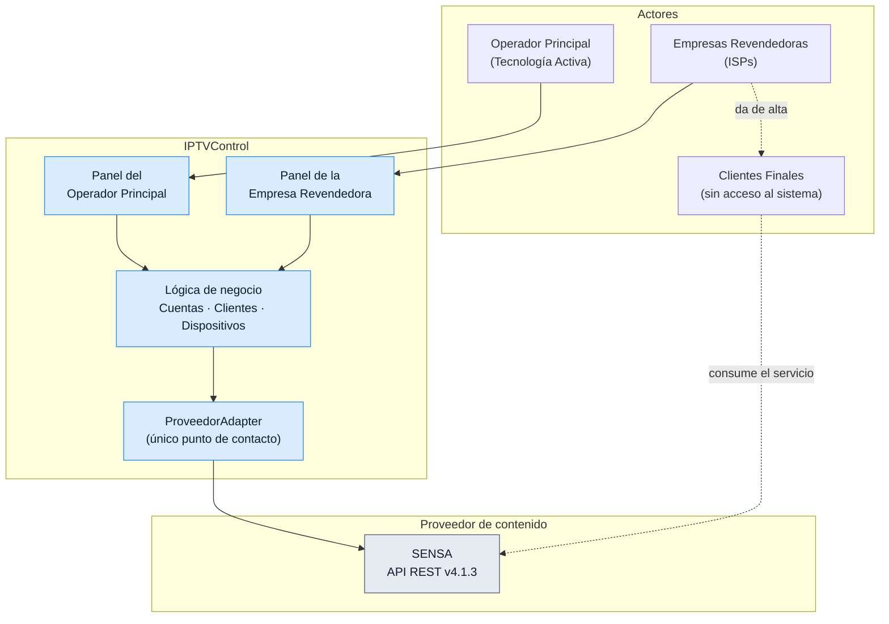

# IPTVControl — Índice del vault

Plataforma multi-tenant de gestión de reventa de cuentas IPTV, de **TECNOLOGIA ACTIVA S.A.S.**
(Godoy Cruz, Mendoza), sobre la plataforma de contenido **SENSA**.

> **Objetivo del sistema:** que la operación de venta y gestión de cuentas y dispositivos funcione
> sin intervención manual del Operador Principal en el día a día.

## Por dónde empezar

| Si querés entender… | Leé |
|---|---|
| Quién es quién en el negocio | [[Glosario de actores y entidades]] |
| Cómo se cobra y cuánto | [[Modalidades comerciales]] |
| Qué le pasa a un cliente desde el alta hasta la baja | [[Ciclo de vida del Cliente Final]] |
| Cuántos dispositivos entran en una cuenta | [[Capacidad de una Cuenta]] |
| Cómo está construido | [[Stack técnico]] · [[Aislamiento multi-tenant]] |
| Cómo se habla con SENSA | [[Patrón ProveedorAdapter]] · [[Integración con SENSA]] |
| Qué pasa al dar de alta un cliente | [[Flujo - Alta de Cliente Final]] |
| Cómo se despliega | [[Despliegue y operación]] · [[Arranque en frío y seed]] |
| Qué falta decidir | [[Decisiones pendientes]] |

## Mapa del sistema

## Las cinco reglas que más se consultan

1. **Una Cuenta admite 3 dispositivos fijos + 3 móviles**, con topes independientes por categoría.
   Ver [[Capacidad de una Cuenta]].
2. **Suspensión ≠ baja definitiva.** La suspensión reserva el Dispositivo; la baja lo libera. La
   única vía para liberar un Dispositivo bloqueado es la transición explícita a baja definitiva.
   Ver [[Ciclo de vida del Cliente Final]].
3. **El Operador Principal no ve datos comerciales de sus Empresas Revendedoras**: identifica todo
   por ID. Ver [[Aislamiento multi-tenant]].
4. **La contraseña de una Cuenta no se rota nunca** al reasignar un Dispositivo. Es un riesgo
   aceptado y confirmado, no un pendiente. Ver [[Riesgo aceptado - contraseña compartida]].
5. **La lógica de negocio nunca le habla directo a SENSA.** Ver [[Patrón ProveedorAdapter]].

## Convenciones de este vault

- Las notas de `10 - Negocio` describen **qué** hace el sistema; las de `20 - Arquitectura`, **cómo**.
- Cada nota abre con la referencia al documento de `docs/` del que deriva.
- Los diagramas son Mermaid embebido, para que se rendericen en Obsidian sin plugins.
