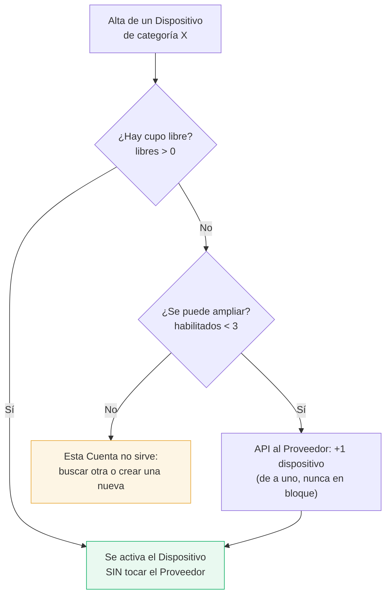

# Capacidad de una Cuenta

Toda la operación gira alrededor de este número: **3 dispositivos fijos + 3 móviles por Cuenta**,
con topes **independientes** por categoría. Si entra, el alta no cuesta nada; si no entra, hay que
crear una Cuenta nueva — y la Cuenta es lo que se factura.

## Los tres números que hay que distinguir

| Concepto | Qué significa |
|---|---|
| **Habilitados** | Cuántos dispositivos de esa categoría tiene habilitados la Cuenta **en el Proveedor**. Arranca en 1, tope 3. |
| **Ocupados** | Cuántos Dispositivos de IPTVControl están usando lugar: los `activo` **y** los `bloqueado_por_suspension`. |
| **Libres** | `habilitados - ocupados`. Son cupos ya pagados y sin usar. |

Que los `bloqueado_por_suspension` cuenten como ocupados es deliberado: están liberados en SENSA,
pero **reservados** para su titular suspendido. Ver [[Ciclo de vida del Cliente Final]].

## Cómo se decide dónde entra un alta

## Baja: la lógica inversa exacta

Al dar de baja un Dispositivo se **resta 1 dispositivo habilitado** en el Proveedor. Dos detalles:

- Los **móviles** nunca bajan de 1: la API de SENSA exige `auto_provision_count_mobile` entre 1 y 3.
- Los **fijos** sí pueden llegar a 0.

## Alerta de "cerca del tope"

Cuando una Cuenta llega a **2 de 3** en alguna categoría, el panel de la Empresa Revendedora muestra
un aviso visual (no correo, no notificación push). Anticipa que el próximo alta de esa categoría va
a requerir otra Cuenta.

El umbral 2 es el valor inicial sugerido y **es configurable** por el Operador Principal desde
Configuración, para no tener que tocar código si se decide otro valor.

## Cómo se ve en el panel

La ocupación se representa con un medidor de barras segmentadas, que toma el vocabulario visual del
propio logo (las barras de señal junto al monitor):

- barra azul llena → dispositivo activo
- barra ámbar llena → bloqueado por suspensión
- barra vacía → cupo disponible

## Ver también

- [[Flujo - Alta de Cliente Final]]
- [[Flujo - Migración de Cuenta]]
- [[Integración con SENSA]]
