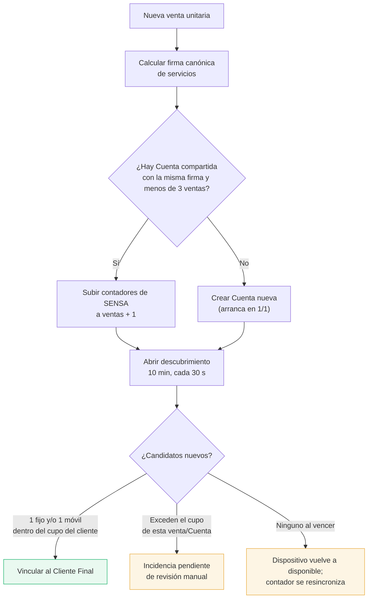

# Capacidad de una Cuenta

El tope comercial depende del **modo** de la Cuenta:

- **Exclusiva**: un único Cliente Final, hasta **3 fijos + 3 móviles** (6 Dispositivos en total).
- **Compartida**: hasta **3 ventas** de Clientes Finales distintos, cada una con hasta **1 fijo +
  1 móvil** (2 Dispositivos por venta, 6 en total como máximo).

> [!info] Reemplaza el modelo anterior
> Este documento reemplaza el esquema previo de "3 Dispositivos globales sin distinción de tipo" y
> el mecanismo de "Dispositivos de reserva técnicos" (fantasma, con MAC generada localmente). Esos
> conceptos ya **no existen** en el sistema — quedan mencionados acá sólo como referencia histórica.

## El mecanismo real de bloqueo: contadores nativos de SENSA

SENSA expone en cada Cuenta dos contadores por categoría —
`auto_provision_count_mobile` y `auto_provision_count_stationary`— que limitan cuántos
Dispositivos de esa categoría puede auto-provisionar la Cuenta. IPTVControl los mantiene
sincronizados con la cantidad de **ventas activas**:

| Cuenta | Contadores |
|---|---|
| Compartida, 1 venta | 1 / 1 |
| Compartida, 2 ventas | 2 / 2 |
| Compartida, 3 ventas (tope) | 3 / 3 |
| Exclusiva | fijo en 3 / 3, no varía |

Al sumarse una venta nueva, IPTVControl sube el contador **antes** de abrir la ventana de
vinculación (si no, SENSA rechazaría el primer login del cliente nuevo). Al darse de baja o
suspenderse la última venta de un cliente, el contador se resincroniza hacia abajo (nunca por
debajo de 1 mientras la Cuenta esté activa).

## Cómo se decide dónde entra un alta

Antes de crear una venta unitaria, el wizard permite elegir servicios y siempre incluye el básico
código 1. Solo se reutilizan Cuentas con firma de servicios idéntica.

## Descubrimiento después del primer login

El formulario no solicita tipo ni MAC. SENSA reporta ID, MAC y tipo al primer login. IPTVControl
toma una instantánea previa y sondea cada 30 segundos durante 10 minutos:

- En una venta unitaria se pueden vincular hasta 1 candidato fijo + 1 candidato móvil al mismo
  Cliente Final ("fijo" = TV/`stationary`; "móvil" = celular, tablet o PC por navegador
  `cloud_client` — confirmado por Bruno el 24/08/2026, caso Valentín Alamo).
- En una Cuenta exclusiva pueden vincularse hasta 3 fijos + 3 móviles al mismo Cliente Final.
- Un candidato que exceda el cupo de su categoría (para ese cliente, o para la Cuenta si es
  exclusiva) queda como incidencia pendiente de revisión manual — nunca se elimina solo.
- Si vence la ventana sin ningún candidato para una venta nueva, el Dispositivo vuelve a
  `disponible` y el contador se resincroniza contra las ventas activas reales.

Una colisión de MAC nunca autoriza a reasignar automáticamente un Dispositivo existente. Ver
también [[Flujo - Migración de Cuenta]] para el caso "Pepito/Marcelo" de corrección manual de
vinculación.

## Baja y suspensión

- La baja definitiva elimina el Dispositivo. En una Cuenta compartida, si ese fue el último
  Dispositivo del Cliente Final, los contadores de SENSA se sincronizan hacia abajo.
- La suspensión bloquea la capacidad comercial para el mismo Cliente Final (sigue contando como
  venta activa a efectos de los contadores). No se ofrece a otra venta hasta la reactivación o la
  transición explícita a baja definitiva.

Ver [[Ciclo de vida del Cliente Final]].

## Alerta de "cerca del tope"

Cuando una Cuenta compartida llega a **2 de 3 ventas**, o una Cuenta exclusiva se acerca a su tope
de 3 fijos + 3 móviles, el panel de la Empresa Revendedora muestra un aviso visual. Anticipa que
una venta adicional puede requerir otra Cuenta compatible.

El umbral 2 es el valor inicial sugerido y **es configurable** por el Operador Principal desde
Configuración, para no tener que tocar código si se decide otro valor.

## Cómo se ve en el panel

La ocupación se representa con un medidor de barras segmentadas (3 en una Cuenta compartida, 6 en
una exclusiva), que toma el vocabulario visual del propio logo (las barras de señal junto al
monitor):

- barra azul llena → lugar ocupado (venta o Dispositivo, según el modo)
- barra ámbar llena → bloqueado por suspensión
- barra vacía → cupo comercial disponible

## Límite real de los contadores de SENSA (confirmado 21/08/2026)

Los contadores `auto_provision_count*` evitan un alta explícita por API y probablemente los tipos
"phone"/"stationary", pero **no bloquean** un inicio de sesión por el reproductor web de SENSA
(`cloud_client`), que auto-provisiona un Dispositivo nuevo aunque la Cuenta esté al tope de sus
contadores. Por eso la defensa real contra un Dispositivo de más es la **detección activa** (botón
"Consultar al proveedor" + barrido periódico `barrer_inventario_cuentas`), no el bloqueo de
capacidad en sí — ver [[Integración con SENSA]].

## Ver también

- [[Flujo - Alta de Cliente Final]]
- [[Flujo - Migración de Cuenta]]
- [[Integración con SENSA]]
