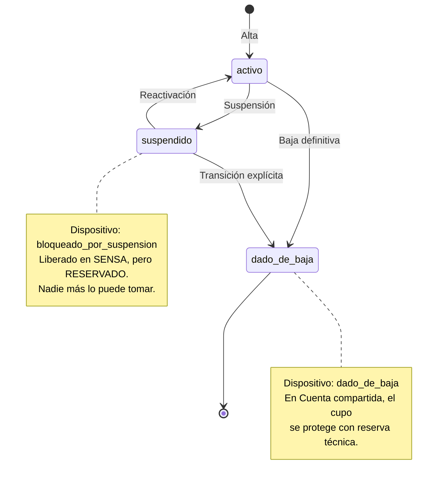

# Ciclo de vida del Cliente Final

La diferencia entre **suspender** y **dar de baja** no está en el cliente: está en **qué le pasa al
Dispositivo**. Es la regla que más consultas genera, así que conviene tenerla clara.

## Qué hace el sistema en cada transición

| Transición | En el Proveedor | Estado del Dispositivo | ¿Otro cliente puede tomarlo? |
|---|---|---|---|
| **Alta** | Crea o reutiliza Cuenta y descubre el equipo después del primer login | `pendiente` → `activo` o `ambiguo` | No |
| **Suspensión** | Elimina el dispositivo en SENSA y conserva su capacidad comercial bloqueada | `bloqueado_por_suspension` | **No** |
| **Reactivación** | Abre nuevamente el descubrimiento para el mismo Cliente Final | `pendiente` → `activo` o `ambiguo` | No |
| **Baja definitiva** | Elimina el dispositivo; en Cuenta compartida repone una reserva técnica | `dado_de_baja` | La capacidad comercial sí; el Dispositivo y su MAC, no |

## La regla permanente

> La **única vía** para liberar a otra venta la capacidad bloqueada por suspensión es la transición
> explícita de *suspendido* → *baja definitiva*.

No es un pendiente de roadmap: es una regla de negocio permanente. La razón es concreterísima — si
la capacidad bloqueada se pudiera vender, las credenciales de esa Cuenta terminarían en manos de
otro Cliente Final mientras el suspendido todavía podría volver. Ver
[[Riesgo aceptado - contraseña compartida]].

## Baja individual de un Dispositivo

Un Cliente Final con varios Dispositivos puede perder uno **sin** que se lo dé de baja como cliente:
la baja individual no afecta a sus otros Dispositivos ni a su estado general.

## Orden de las operaciones (y por qué)

- **Altas:** primero se reserva localmente, después se llama al Proveedor, y al final se confirma. Si
  el Proveedor falla, se revierte la reserva. El peor caso posible es una fila local sin dispositivo
  en SENSA: no cuesta plata y la reconciliación lo detecta.
- **Bajas y suspensiones:** primero el Proveedor, después lo local. Si el Proveedor falla, no se
  cambió nada y el usuario ve el mensaje de sistema congestionado. Al revés se correría el riesgo de
  dar de baja a alguien en el panel mientras sigue mirando TV.

Ver [[Consistencia con el Proveedor]].

## Ver también

- [[Flujo - Alta de Cliente Final]]
- [[Capacidad de una Cuenta]]
- [[Validación de ID de gestión externa]]
