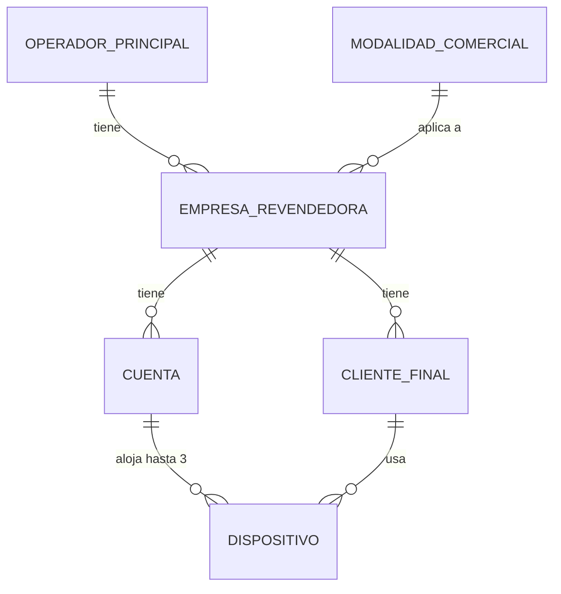

# Glosario de actores y entidades

> Nomenclatura oficial del proyecto. Se usa igual en código, base de datos y documentación.
> La unidad oficial es **Dispositivo**; para capacidad libre se usa **cupo**.

## Actores

| Actor | Qué es | Accede al sistema |
|---|---|---|
| **Proveedor** | Plataforma de contenido IPTV. Hoy SENSA. Reemplazable a futuro. | No (es una API) |
| **Operador Principal** | Titular del contrato con el Proveedor. Crea las Cuentas, define modalidades y precios. Tecnología Activa es el primero. | Sí, panel propio |
| **Empresa Revendedora** | ISP que compra Cuentas al Operador y las revende. Define sus propios precios al Cliente Final. | Sí, panel propio y aislado |
| **Cliente Final** | Quien consume el servicio. Lo da de alta la Empresa Revendedora. | **No**, nunca |

El hecho de que el Cliente Final **no tenga acceso** es la razón por la que los logins del sistema
se llaman [[Team Members]] y no "usuarios": si a las dos cosas se les dice "usuario", aparecen
errores de permisos.

## Entidades

### Cuenta

Unidad de contratación entre el Operador Principal y el Proveedor, y **la unidad que se factura**.

- Un usuario, una contraseña y un PIN únicos.
- Contraseña de exactamente **8 dígitos numéricos** y PIN de **6 dígitos numéricos**.
- Un identificador tipo **DNI** exigido por SENSA, generado por IPTVControl (no es un DNI real).
- Un correo de contacto derivado del correo de la Empresa Revendedora.
- Capacidad comercial máxima global: **3 Dispositivos**, indistintamente del tipo.
- Una Cuenta completa pertenece a un solo Cliente Final y recibe todos los servicios contratados.
- Una Cuenta compartida aloja hasta 3 ventas unitarias con idéntica firma de servicios.

### Dispositivo

Unidad de gestión interna de la Empresa Revendedora: un equipo físico (TV o móvil) vinculado a un
Cliente Final dentro de una Cuenta.

- **No tiene precio propio** en el sistema: cuánto le cobra la Empresa Revendedora a su Cliente
  Final se define por fuera de IPTVControl.
- El formulario no pide tipo ni MAC. SENSA reporta ID, MAC y tipo al primer login; IPTVControl los
  detecta mediante sondeo durante la ventana inicial. Varios candidatos dejan ambigua una venta
  unitaria; una Cuenta completa puede vincular hasta 3 al mismo Cliente Final.
- Admite una **nota descriptiva** libre ("TV living"), que es dato interno: no se envía al
  Proveedor y no se expone al Operador Principal.
- Puede ser una **reserva técnica** sin Cliente Final, con MAC unicast administrada localmente,
  para proteger un cupo no vendido de una Cuenta compartida.

### Relación Cuenta – Dispositivo – Cliente Final

Una Cuenta completa puede vincular hasta 3 Dispositivos al mismo Cliente Final. Una Cuenta
compartida puede alojar hasta 3 ventas unitarias, cada una para un Cliente Final y exactamente 1
Dispositivo, siempre que tengan idéntica firma de servicios.

> **Punto crítico:** todos ellos reciben **las mismas credenciales**, sin saberlo entre sí. Ver
> [[Riesgo aceptado - contraseña compartida]].

## Ver también

- [[Modalidades comerciales]]
- [[Ciclo de vida del Cliente Final]]
- [[Team Members]]
