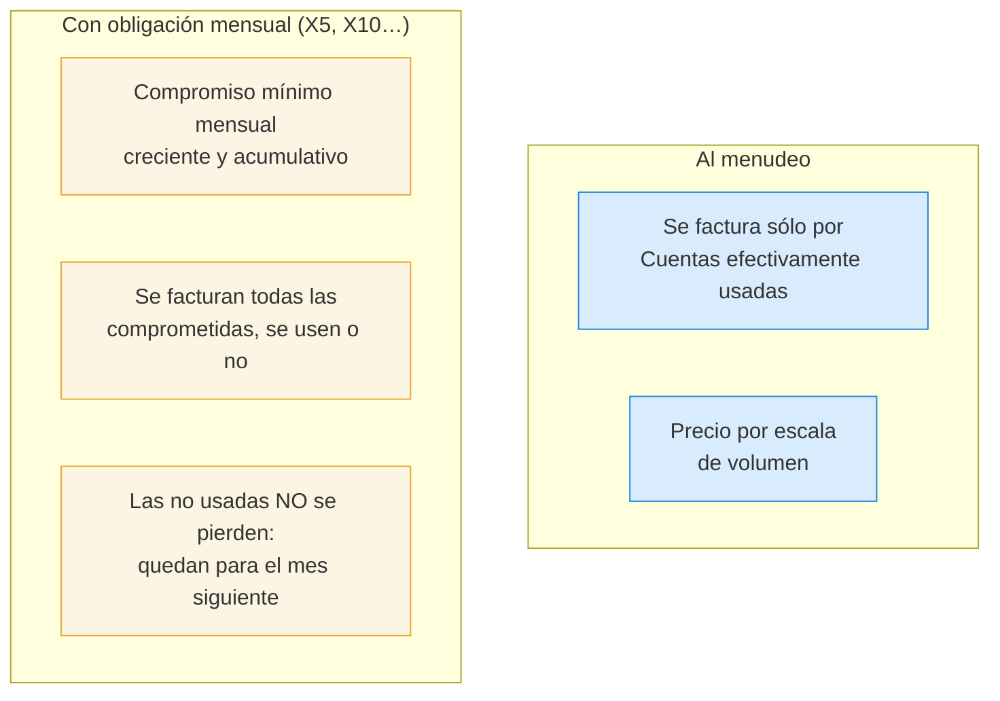

# Modalidades comerciales

Una Empresa Revendedora opera bajo **una sola modalidad a la vez**. El cambio —tanto downgrade como
upgrade— es **potestad exclusiva del Operador Principal**: depende del trato comercial pactado, no es
una elección libre de la Empresa Revendedora.

## Las dos modalidades

### Cómo crece la obligación mensual

Con un plan X5 (ritmo de incremento 5):

| Mes | Cuentas facturadas | Puede tener activas |
|---|---|---|
| 1 | 5 | más de 5, sin problema |
| 2 | 10 | " |
| 3 | 15 | " |

El **ritmo de incremento lo parametriza el Operador Principal**: no está hardcodeado, porque puede
variar entre distribuidores o entre Proveedores.

## Precios

- Los define el **Operador Principal**, son parametrizables y se actualizan por IPC creando una
  vigencia nueva.
- La **Empresa Revendedora define sus propios precios** hacia el Cliente Final. IPTVControl **no
  interviene** en esa facturación, pero sí le muestra los precios vigentes que le corresponden.
- Todo cambio de precio queda en el [[Registro de auditoría]] con valor anterior y nuevo.

## Lo que el sistema NO hace

> Facturación y cobranza están **fuera del alcance**. IPTVControl no emite comprobantes ni gestiona
> pagos: produce el [[Reporte de consumo]] para que la facturación se haga a mano.

## Ver también

- [[Reporte de consumo]]
- [[Glosario de actores y entidades]]
