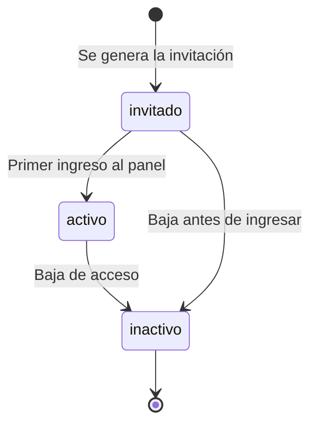

# Team Members

Un **Team Member** es un login con permisos sobre alguno de los dos paneles. No es un actor de
negocio: es la entidad de *acceso técnico* al sistema.

## Por qué no se llama "usuario"

En la mayoría de las apps, "usuario" puede significar dos cosas: quien *usa el servicio* o quien
*administra el sistema*. En IPTVControl son entidades completamente distintas — el Cliente Final **no
tiene login** —, así que llamar "usuario" a las dos cosas obliga a adivinar cuál aplica. Y ese tipo de
ambigüedad es exactamente lo que produce bugs de permisos en sistemas multi-tenant.

Analogía: Stripe y Notion separan "Team" (quien entra al back office) de "Customers" (a quien le
vendés, que nunca inicia sesión). Es la misma separación que ya existe en el glosario.

Por eso la ruta es `/team-members` y no `/users`, y en la interfaz se muestra como **"Equipo"**.

## Roles

| Rol | Pertenece a | En el MVP |
|---|---|---|
| `operator_admin` | Operador Principal | **En uso** — permisos totales |
| `operator_staff` | Operador Principal | Reservado a futuro |
| `reseller_admin` | Una Empresa Revendedora | **En uso** — único rol del lado revendedor |
| `reseller_staff` | Una Empresa Revendedora | Reservado a futuro |

Un Team Member pertenece a **un solo tenant**: o al Operador Principal, o a una Empresa Revendedora,
nunca a ambos. En el MVP cada Empresa Revendedora opera con un único `reseller_admin`.

## Estados

Dar de baja un acceso lo desactiva en IPTVControl **y** bloquea el login en Auth0.

## Ver también

- [[Arranque en frío y seed]]
- [[Aislamiento multi-tenant]]
