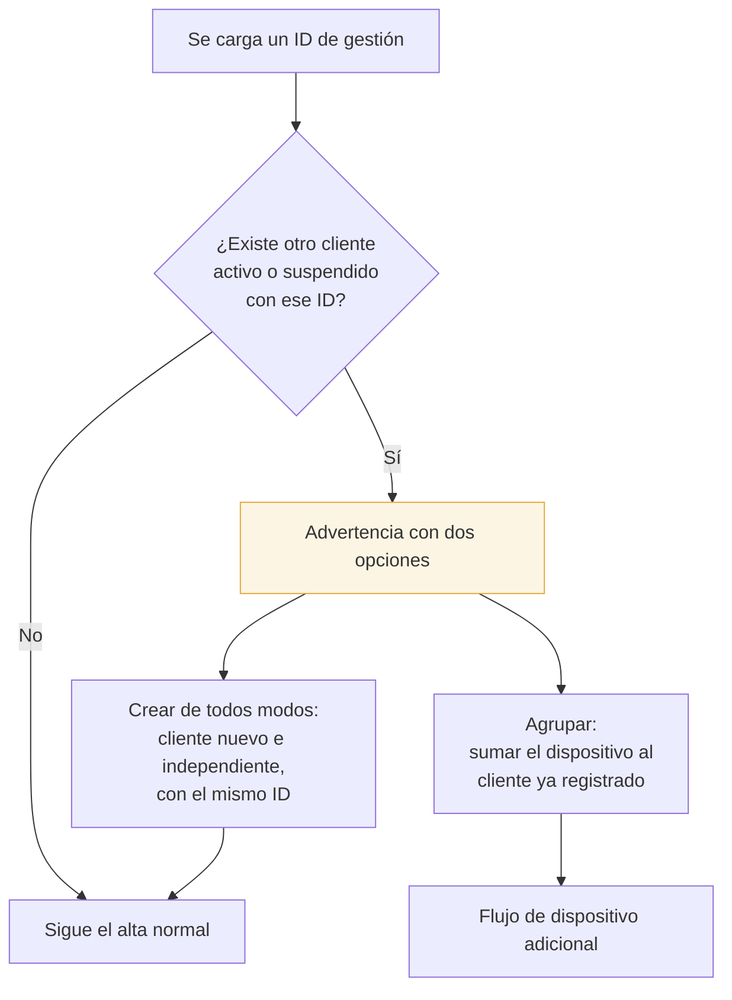

# Validación de ID de gestión externa

El Cliente Final puede tener, opcionalmente, el **ID que usa la Empresa Revendedora en su propio
sistema de gestión** (`id_gestion_externo`). Sirve para conciliar con su CRM o su facturación.

## La regla: avisar, no decidir

Si el ID cargado ya existe en otro Cliente Final **de la misma Empresa Revendedora**, el sistema:

- **No bloquea** el alta.
- **No agrupa** automáticamente.
- **Avisa** y le da a elegir.

**Por qué se deja elegir:** las dos situaciones son legítimas. Puede ser que se esté dando de alta un
segundo dispositivo del mismo abonado (agrupar), o que la Empresa Revendedora reutilice el mismo ID de
CRM para varios abonados del mismo grupo familiar (crear igual).

## Alcance de la búsqueda

- Sólo dentro de la **misma Empresa Revendedora**. Nunca cruza con otras: lo garantiza el
  [[Aislamiento multi-tenant]] y además está filtrado explícitamente.
- Sólo contra clientes **activos o suspendidos**. No tiene sentido advertir por uno dado de baja.

## En el panel

La verificación se dispara al salir del campo (y también con un botón "Verificar"), en el paso 1 del
asistente. Si hay coincidencias, se listan con su número de cliente y su cantidad de dispositivos, y
no se puede avanzar sin elegir una de las dos opciones.

## Ver también

- [[Flujo - Alta de Cliente Final]]
- [[Flujo - Migración de Cuenta]]
