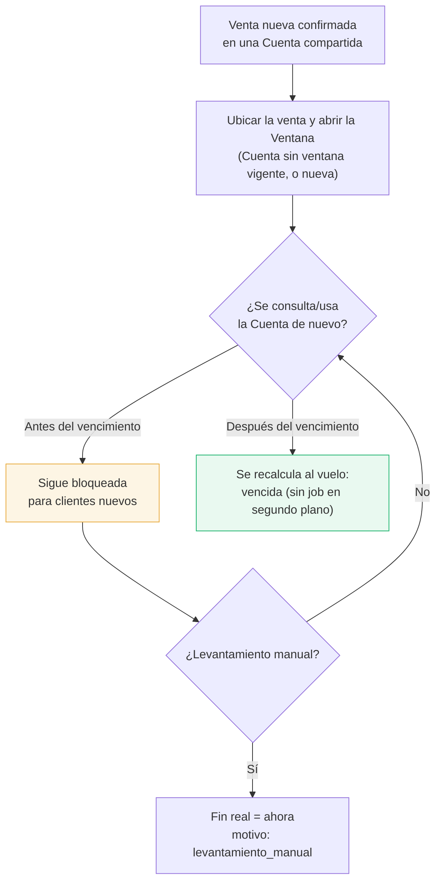

# Ventana de curiosidad (Fase 2)

Restricción **local** de IPTVControl (no un mecanismo de SENSA) que reduce la ventana de tiempo en
la que un "cliente curioso" — alguien que compró sólo para mirar las credenciales o el contenido —
puede pasarle el usuario/contraseña a otra persona antes de que la Empresa Revendedora note algo
raro.

No reemplaza el [[Riesgo aceptado - contraseña compartida|riesgo aceptado de credenciales
compartidas sin rotación]]: sigue existiendo. Sólo acorta la ventana de exposición para un Cliente
Final **nuevo** después de cada venta que entra a una Cuenta compartida.

## Alcance

- Sólo [[Capacidad de una Cuenta|Cuentas compartidas]]. Las exclusivas nunca se bloquean.
- **Nunca bloquea al dueño** de la venta que abrió la ventana: puede seguir vinculando sus propios
  Dispositivos (1+1 o 2+2) sin restricción.
- Bloquea únicamente que la Cuenta se le ofrezca a otro Cliente Final nuevo — por el buscador
  automático de [[Flujo - Alta de Cliente Final|alta]] y por la reasignación manual de un
  Dispositivo liberado ([[Flujo - Migración de Cuenta]]).
- No toca los contadores `auto_provision_count*` de SENSA: un cupo bloqueado por la ventana sigue
  contando como libre a esos efectos.

## Ciclo de vida

- **Ubicación automática:** la duración **no** decide dónde va la venta. El sistema la ubica en la
  Cuenta compartida compatible más antigua **sin ventana vigente** y le abre la ventana; si no hay
  ninguna, crea una Cuenta nueva.
- **Duración predeterminada:** cada Empresa Revendedora la define en `/settings` (días/horas/
  minutos; puede ser `0` = no se bloquea la Cuenta para clientes nuevos).
- **Override por venta:** la predeterminada **sólo precarga el formulario, no es un tope**. El
  vendedor puede elegir en cada venta la duración que quiera, incluso `0`. El backend sólo exige un
  entero de minutos ≥ 0.
- **No retroactiva:** la duración que queda guardada es la vigente al momento de esa venta puntual.
  Cambiar el predeterminado después no afecta ventanas ya abiertas.
- **Vencimiento al vuelo:** no hay job en segundo plano. Cada consulta relevante (búsqueda de
  Cuenta, apertura de una nueva, vista de Cuenta) cierra primero las ventanas vencidas de esa
  Cuenta antes de decidir.
- **Levantamiento manual:** desde `/accounts/:id`, con confirmación y registro en el Audit Log
  (`levantamiento_ventana_curiosidad`).

## Historial

Cada Cuenta compartida conserva sus ventanas anteriores: inicio, fin previsto, fin real, duración
predeterminada vs. aplicada, quién la abrió y quién la levantó (si corresponde). Visible desde la
vista de Cuenta.

## Puntos de enforcement en el backend

Todos pasan por `VentanasCuriosidadService`, bajo el mismo advisory lock por Cuenta que ya usa
`CuentasProvisioningService` (ver [[Consistencia con el Proveedor]]):

- `buscarCuentaConLugar()` — busca la Cuenta compatible más antigua **sin** ventana vigente. Es la
  única vía de ubicación automática, sin importar la duración que traiga la venta.
- `reservarCapacidadPorNuevaVenta()` — abre la ventana en la misma transacción que crea la venta.
- `reasignar()` de un Dispositivo liberado — llamada "otra forma de alta" (regla de negocio 6):
  si el cliente destino no tiene venta previa en esa Cuenta, se valida el mismo bloqueo
  (`asegurarClientePermitido`). **Pendiente:** este camino todavía no crea la fila de venta
  compartida correspondiente — ver `docs/05_Decisiones_Pendientes.md`, sección 4.
- Resolución de incidencias de Dispositivo no autorizado — misma reserva que un alta nueva.

## Ver también

- [[Capacidad de una Cuenta]]
- [[Flujo - Alta de Cliente Final]]
- [[Flujo - Migración de Cuenta]]
- [[Riesgo aceptado - contraseña compartida]]
