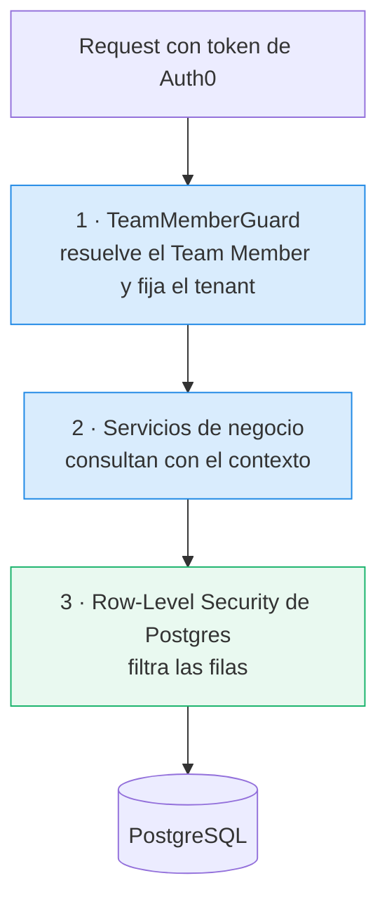

# Aislamiento multi-tenant

El aislamiento entre Empresas Revendedoras es **total**: ninguna ve datos de otra, **ni tampoco datos
del Operador Principal**. Y el Operador Principal, aunque necesita dar soporte, **no ve la cartera
comercial** de sus Empresas Revendedoras — porque él también vende IPTV.

## Dos capas de defensa



**Por qué dos capas:** si algún día una query se escribe sin el filtro correcto, Postgres igual no
devuelve filas de otro tenant. Es el equivalente a separar clientes por VLAN además de filtrarlos por
ACL: si falla la ACL, la VLAN contiene.

## Cómo se activa el contexto

Prisma no soporta RLS de forma nativa, así que en cada transacción se ejecuta primero:

```sql
SELECT set_config('app.current_tenant',   '<empresa_revendedora_id>', TRUE);
SELECT set_config('app.current_operador', '<operador_principal_id>',  TRUE);
SELECT set_config('app.is_operator',      'on' | 'off',               TRUE);
```

El tercer parámetro `TRUE` hace el valor **local a la transacción**. Sin eso, al reutilizarse una
conexión del pool podría quedar pegado el tenant del request anterior — el peor bug posible acá.

> **Detalle que hace o rompe todo:** el owner de una tabla **ignora** las políticas de RLS. Por eso
> las migraciones corren con el owner del schema y la aplicación se conecta con un usuario aparte
> (`iptvcontrol_app`, sin `BYPASSRLS`). Sin esa separación, RLS no aplicaría nunca.

## Qué ve el Operador Principal (tabla normativa)

| Campo | ¿Lo ve? |
|---|---|
| ID interno de la Cuenta | Sí |
| ID de la Cuenta en el Proveedor | Sí — lo necesita para soporte |
| Estado de la Cuenta | Sí |
| Dispositivos habilitados (conteo "2 de 3") | Sí |
| **Usuario / contraseña / PIN de la Cuenta** | **No** |
| ID del Dispositivo en el Proveedor | Sí |
| Tipo y estado del Dispositivo | Sí |
| `numero_cliente` | Sí — es un número, no identifica a nadie |
| **Nombre y datos de contacto del Cliente Final** | **No** |
| **Nota descriptiva del Dispositivo** | **No** — texto libre, podría contener el nombre |

Esta tabla es **normativa**: cualquier endpoint o vista nueva tiene que respetarla.

Y no se cumple ocultando campos en el frontend: **no llegan al frontend**. Se implementa en los
mappers del backend (`cuentas.mapper.ts`) y está cubierta por tests.

## Verificación

`backend/prisma/verificar-rls.sql` prueba, conectándose como el usuario de aplicación:

1. El tenant A ve sólo su cliente (con un `SELECT` sin `WHERE`).
2. El tenant B ve sólo el suyo.
3. El Operador alcanza las filas para poder contar.
4. **Sin contexto: cero filas.**
5. El tenant A **no puede escribir** en el tenant B (`UPDATE 0`).

## Ver también

- [[Team Members]]
- [[Stack técnico]]
