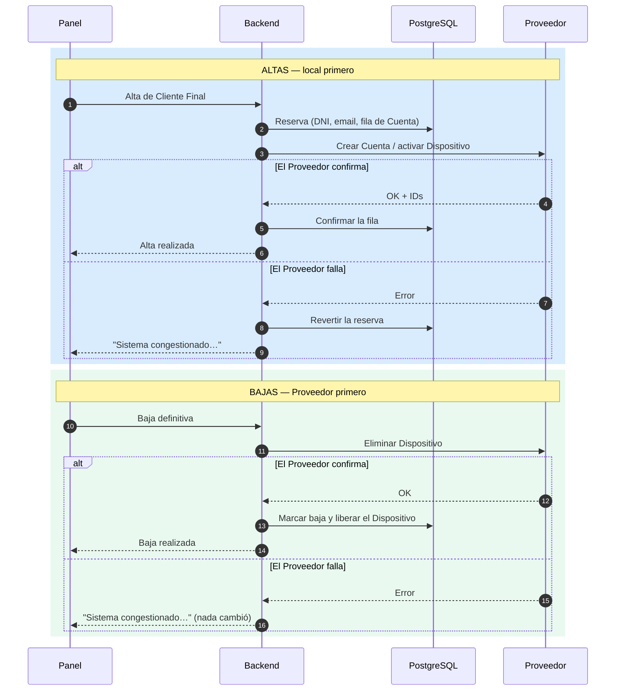

# Consistencia con el Proveedor

La regla de negocio es explícita: *"no se debe dejar la operación en un estado intermedio
inconsistente"*. El problema real es que hay dos sistemas —la base local y SENSA— y el segundo puede
fallar en cualquier momento.

## El orden de las operaciones no es arbitrario

**El razonamiento:** de los dos estados inconsistentes posibles, se elige siempre el menos grave.

- En un alta, lo menos grave es "fila local sin Cuenta en SENSA": no consume licencias, no cuesta
  plata y la reconciliación lo detecta. Lo inverso —una Cuenta en SENSA que IPTVControl no conoce—
  costaría plata y sería invisible.
- En una baja, lo menos grave es "sigue todo activo y el usuario reintenta". Lo inverso sería dar de
  baja a alguien en el panel mientras sigue mirando TV.

## Cola de reintentos (BullMQ)

Cuando el Proveedor falla **después** de que el estado local ya se confirmó, no se puede deshacer sin
mentirle al usuario. Esa corrección se encola y se reintenta con espera creciente:

| Trabajo | Qué hace |
|---|---|
`sincronizar_capacidad_cuenta` | Recalcula la capacidad desde la base y la empuja al Proveedor |
`eliminar_dispositivo` | Reintenta una baja que no llegó |
`reconciliar_dispositivos_cuenta` | Captura por polling los IDs de dispositivos auto-provisionados |
`cerrar_cuenta` | Reintenta un cierre de Cuenta |

Todos son **idempotentes**: recalculan el estado deseado y lo empujan. Correrlos dos veces da el
mismo resultado — que es lo que hace seguro reintentar.

Política: 6 intentos con espera exponencial desde 30 s (30 s, 1 m, 2 m, 4 m, 8 m, 16 m).

## Casos especiales

- **Identificador repetido** (códigos 803 / 1002): no se muestra al usuario. Se incrementa el DNI y
  se reintenta, hasta el límite configurable (por defecto 25).
- **Email repetido** (805): mismo criterio, se avanza el correlativo del correo.
- **Recurso inexistente** (901 / 903): en bajas se trata como éxito. Si el objetivo era que no
  exista, ya está cumplido.

## Panel de salud

Cada llamada al Proveedor deja traza (operación, código, duración). El dashboard del Operador
Principal muestra llamadas exitosas y fallidas de las últimas 24 h, la última exitosa y el tamaño de
la cola de reintentos, con un semáforo. Sirve para enterarse **antes** de que una Empresa Revendedora
llame a reportar el síntoma.

## Ver también

- [[Patrón ProveedorAdapter]]
- [[Integración con SENSA]]
