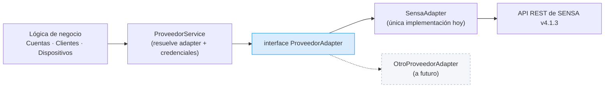

# Patrón ProveedorAdapter

Es **el patrón central del sistema**. La regla es de una línea:

> La lógica de negocio de IPTVControl **nunca** le habla directo a la API de SENSA.

## Por qué importa

El sistema tiene que poder sumar otros Proveedores de contenido a futuro. Si la lógica de negocio
conociera los códigos de error de SENSA, o sus nombres de campo, esa migración sería un refactor
completo. Con el adapter, es escribir una clase nueva.

Analogía de telecom: es lo mismo que no cablear la lógica de facturación de un ISP a un modelo
puntual de OLT.

## El contrato

`ProveedorAdapter` declara las operaciones que **cualquier** Proveedor debe soportar:

| Operación | Para qué |
|---|---|
| `probarConexion` | Botón "Probar conexión" del menú de parametrización |
| `crearCuenta` | Alta de Cuenta con máximo comercial global de 3 Dispositivos |
| `actualizarCapacidadDispositivos` | Parametrización necesaria para ventas, reservas y autoprovisión |
| `activarDispositivo` | Creación explícita de reservas técnicas con MAC local |
| `eliminarDispositivo` | Baja, suspensión y liberación de una reserva antes de vender |
| `listarDispositivos` | Descubrimiento y reconciliación por polling |
| `consultarCuenta` / `consultarServicios` | Estado y parametrización de contenido |
| `cerrarCuenta` | Cierre de Cuenta |
| `consultarLicencias` | Reporte de consumo |

Cada operación recibe las credenciales de forma **explícita**, en lugar de leerlas de un global: así
el adapter queda sin estado y puede servir a varios Operadores Principales sin mezclar credenciales.

## Lo que el adapter traduce (y la lógica de negocio nunca ve)

| IPTVControl | SENSA |
|---|---|
| Cuenta | `user` (identificado por `dni` / `customer_id`) |
| Capacidad global de Dispositivos | Traducción interna a `auto_provision_count`, `auto_provision_count_stationary` y `auto_provision_count_mobile` |
| Reserva técnica | Dispositivo sin Cliente Final, con MAC unicast administrada localmente |
| Candidato autoprovisionado | ID, MAC y tipo informados por SENSA al primer login |
| Error de identificador repetido | códigos 803 / 1002 → `DniRepetidoError` |
| Proveedor caído | 401/403/500/503/1001/1003 → mensaje de negocio |

La interacción exacta de los tres campos `auto_provision_count` con las reservas técnicas debe
validarse antes del deploy en la Cuenta SENSA productiva dedicada. Esta particularidad queda dentro
del adapter y no modifica el máximo comercial global de 3 definido por la lógica de negocio.

Una colisión de MAC nunca habilita al adapter a reasignar automáticamente un Dispositivo existente.

## Extensión: la API pública de fase 2

El mismo criterio se aplica hacia afuera: los casos de uso viven en servicios de NestJS
independientes de los controllers HTTP. Exponer una API pública para Empresas Revendedoras (fase 2,
no MVP) es agregar controllers nuevos sobre los mismos servicios, sin refactor.

## Ver también

- [[Integración con SENSA]]
- [[Consistencia con el Proveedor]]
- [[Stack técnico]]
