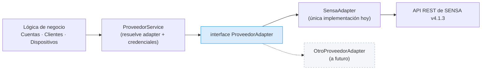

# Patrón ProveedorAdapter

Es **el patrón central del sistema**. La regla es de una línea:

> La lógica de negocio de IPTVControl **nunca** le habla directo a la API de SENSA.

## Por qué importa

El sistema tiene que poder sumar otros Proveedores de contenido a futuro. Si la lógica de negocio
conociera los códigos de error de SENSA, o sus nombres de campo, esa migración sería un refactor
completo. Con el adapter, es escribir una clase nueva.

Analogía de telecom: es lo mismo que no cablear la lógica de facturación de un ISP a un modelo
puntual de OLT.

## El contrato

`ProveedorAdapter` declara las operaciones que **cualquier** Proveedor debe soportar:

| Operación | Para qué |
|---|---|
| `probarConexion` | Botón "Probar conexión" del menú de parametrización |
| `crearCuenta` | Alta de Cuenta (1 fijo + 1 móvil de arranque) |
| `actualizarCapacidadDispositivos` | Ampliar o reducir de a un dispositivo |
| `activarDispositivo` | Alta de Dispositivo |
| `eliminarDispositivo` | Baja y suspensión |
| `reasignarDispositivo` | Migración de Cuenta |
| `listarDispositivos` | Reconciliación por polling |
| `consultarCuenta` / `consultarServicios` | Estado y parametrización de contenido |
| `cerrarCuenta` | Cierre de Cuenta |
| `consultarLicencias` | Reporte de consumo |

Cada operación recibe las credenciales de forma **explícita**, en lugar de leerlas de un global: así
el adapter queda sin estado y puede servir a varios Operadores Principales sin mezclar credenciales.

## Lo que el adapter traduce (y la lógica de negocio nunca ve)

| IPTVControl | SENSA |
|---|---|
| Cuenta | `user` (identificado por `dni` / `customer_id`) |
| Dispositivo tipo `fijo` | `auto_provision_count_stationary` |
| Dispositivo tipo `movil` | `auto_provision_count_mobile` |
| (no se usa) | `auto_provision_count` — los "STB Linux", queda en 0 |
| Error de identificador repetido | códigos 803 / 1002 → `DniRepetidoError` |
| Proveedor caído | 401/403/500/503/1001/1003 → mensaje de negocio |

## Extensión: la API pública de fase 2

El mismo criterio se aplica hacia afuera: los casos de uso viven en servicios de NestJS
independientes de los controllers HTTP. Exponer una API pública para Empresas Revendedoras (fase 2,
no MVP) es agregar controllers nuevos sobre los mismos servicios, sin refactor.

## Ver también

- [[Integración con SENSA]]
- [[Consistencia con el Proveedor]]
- [[Stack técnico]]
