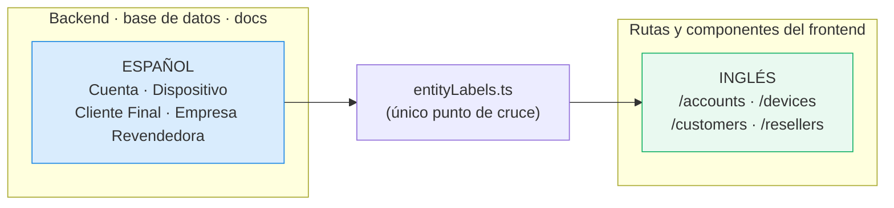

# Stack técnico

| Capa | Tecnología | Por qué |
|---|---|---|
| Backend | **NestJS** | Módulos, DI y guards: estructura fuerte para que el código generado sea consistente entre sesiones. Swagger nativo. |
| Base de datos | **PostgreSQL 16** | Row-Level Security nativo, clave para el [[Aislamiento multi-tenant]]. |
| ORM | **Prisma** | Sin soporte nativo de RLS: se combina con `SET app.current_tenant` por transacción. |
| Colas | **BullMQ + Redis** | Reintentos ante fallas de la API del Proveedor. Ver [[Consistencia con el Proveedor]]. |
| Auth | **Auth0 + JWT** | Tenant propio de Tecnología Activa. Ver [[Team Members]]. |
| Frontend | **Vite + React + shadcn/ui + TanStack Query + React Router** | Sin Next.js: es un panel administrativo interno, no necesita SSR ni SEO. |
| Infraestructura | **VPS propio + Docker Compose** | Sin Kubernetes ni microservicios: sería sobre-ingeniería para ~10 Empresas Revendedoras y ~9.000 Clientes Finales. 4 vCPU / 8 GB alcanzan. |
| Cifrado | **AES-256-GCM** a nivel aplicación | Credenciales de Cuenta y token del Proveedor. Clave maestra fuera del repo. |
| Memoria del agente | **AGENTS.md + Graphify** | Contexto persistente entre sesiones de opencode. |

## Estructura del repositorio

```
iptvcontrol/
├── AGENTS.md              → reglas del proyecto para el agente
├── opencode.json          → carga docs/ en cada sesión
├── docs/                  → documentación normativa (fuente de verdad)
├── vault/                 → este vault de Obsidian
├── graphify-out/          → knowledge graph del repo
├── branding/              → logo definitivo
├── backend/               → NestJS + Prisma
├── frontend/              → Vite + React
├── docker/                → init de Postgres (usuario de aplicación)
└── docker-compose.yml
```

## Dos vocabularios, a propósito



El texto que ve el usuario final siempre está en **español**; lo que está en inglés son los nombres
técnicos (rutas, componentes, variables). La traducción vive centralizada en
`frontend/src/i18n/entityLabels.ts`, no dispersa por los componentes.

## Convenciones de rutas

- Sustantivos en plural, inglés genérico, kebab-case si son compuestos.
- **Anidamiento de un nivel como máximo**: la relación Cuenta → Dispositivo se resuelve con
  `?account_id=`, no con `/accounts/:id/devices/:id`. Un Dispositivo puede migrar de Cuenta, y con
  URLs profundas los enlaces guardados se romperían.
- **Multi-tenancy invisible en la URL**: la misma ruta sirve a los dos paneles.
- `format=csv` cambia el formato de la respuesta en lugar de exponer una ruta de exportación aparte.

## Ver también

- [[Patrón ProveedorAdapter]]
- [[Despliegue y operación]]
