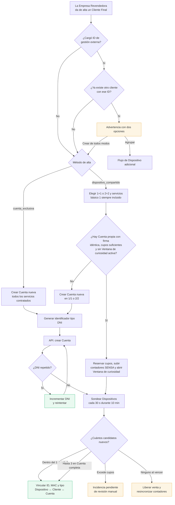

# Flujo — Alta de Cliente Final

Es el flujo más usado del sistema. En el panel se presenta como un **asistente paso a paso**, no como
un formulario único: tiene dos decisiones que cambian el resultado y en un formulario largo se toman
sin leerlas.

## Los dos métodos de alta

## Los cuatro pasos del asistente

| Paso | Qué se define | Regla asociada |
|---|---|---|
| 1 · Cliente | Nombre, contacto e ID de gestión externa | [[Validación de ID de gestión externa]] |
| 2 · Método y servicios | Cuenta exclusiva o compartida; cupos 1+1/2+2, servicios y duración de la [[Ventana de curiosidad]] | [[Capacidad de una Cuenta]] |
| 3 · Dispositivo | Instrucciones para el primer login; no se pide tipo ni MAC | — |
| 4 · Confirmar | Resumen de qué va a pasar antes de tocar el Proveedor | — |

## El identificador tipo DNI

SENSA exige un número de DNI para crear una Cuenta. Como el sistema no gestiona DNIs reales:

- Arranca en `dni_inicial_sensa` (parametrizable por el Operador Principal).
- Se incrementa de a 1 en cada alta.
- Si SENSA responde "identificador repetido", el sistema **suma 1 y reintenta solo**, sin mostrar
  ese error al usuario.
- El correo de contacto se deriva del de la Empresa Revendedora: `contacto@isp.com` →
  `contacto1@isp.com`, `contacto2@isp.com`…

## Descubrimiento del Dispositivo

El equipo se autoprovisiona cuando el Cliente Final inicia sesión. SENSA informa ID, MAC y tipo;
IPTVControl detecta candidatos por polling porque la API no tiene webhooks. En una Cuenta completa
pueden vincularse hasta 3 candidatos al mismo Cliente Final. Una colisión de MAC nunca permite
reasignar automáticamente un Dispositivo existente.

## Si el Proveedor falla

El usuario ve: *"Intente nuevamente más tarde, sistema congestionado, comuníquese con el operador"*.
Y el sistema revierte la reserva local para no dejar un Cliente Final fantasma sin servicio. Ver
[[Consistencia con el Proveedor]].

## Ver también

- [[Flujo - Migración de Cuenta]]
- [[Ciclo de vida del Cliente Final]]
- [[Ventana de curiosidad]]
