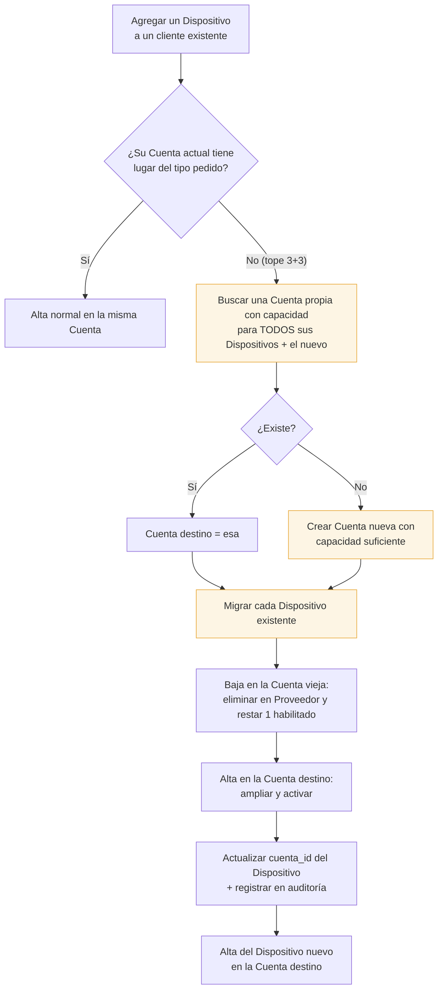

# Flujo — Dispositivo adicional y migración de Cuenta

Cuando un Cliente Final que ya tiene Dispositivos pide uno más, puede pasar que su Cuenta actual ya
esté en el tope 3+3. En ese caso el sistema **le cambia de Cuenta**, migrando ahí sus Dispositivos
existentes.

## La consecuencia que hay que avisar

> Migrar de Cuenta significa que **al Cliente Final le cambian las credenciales**: usuario,
> contraseña y PIN son de la Cuenta, no del cliente.

El panel lo advierte antes de confirmar y lo repite en el aviso posterior, para que quien opera sepa
que tiene que pasarle los datos nuevos.

## Tope absoluto

Si el cliente superara **3 fijos + 3 móviles** en total, no hay Cuenta posible que lo aloje: el
sistema corta con un mensaje explícito en lugar de crear Cuentas sueltas por dispositivo.

## Reasignación de un Dispositivo liberado

Distinto de la migración: un Dispositivo en estado `disponible` (liberado por una baja definitiva)
puede asignarse a un Cliente Final nuevo dentro de la misma Cuenta. Ahí aplica el
[[Riesgo aceptado - contraseña compartida]].

## Ver también

- [[Capacidad de una Cuenta]]
- [[Flujo - Alta de Cliente Final]]
