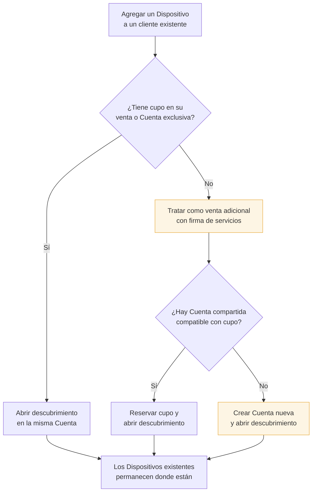

# Flujo — Dispositivo adicional sin migración imposible

Cuando un Cliente Final que ya tiene Dispositivos pide uno más, el sistema respeta los cupos de su
venta y el máximo 3+3 de la Cuenta. Si la venta actual está completa, los Dispositivos existentes **no se migran**:
la venta adicional usa otra Cuenta compatible o crea una nueva.

## Regla central

> Nunca se supera el 1+1/2+2 contratado por una venta ni el 3+3 de la Cuenta, y los Dispositivos
> existentes no se trasladan para forzar un cupo imposible.

La venta adicional puede quedar en otra Cuenta y, por lo tanto, usar las credenciales de esa nueva
Cuenta. El panel debe mostrarlo antes de confirmar.

## Venta compartida

Una venta compartida autoriza 1+1 o 2+2. Mientras el Cliente Final no complete esos cupos, el equipo
adicional queda en la misma Cuenta. Al completarlos, el alta adicional constituye una venta nueva:
busca una Cuenta de firma compatible con cupo o crea una nueva, sin mover equipos existentes.

## Ver también

- [[Capacidad de una Cuenta]]
- [[Flujo - Alta de Cliente Final]]
