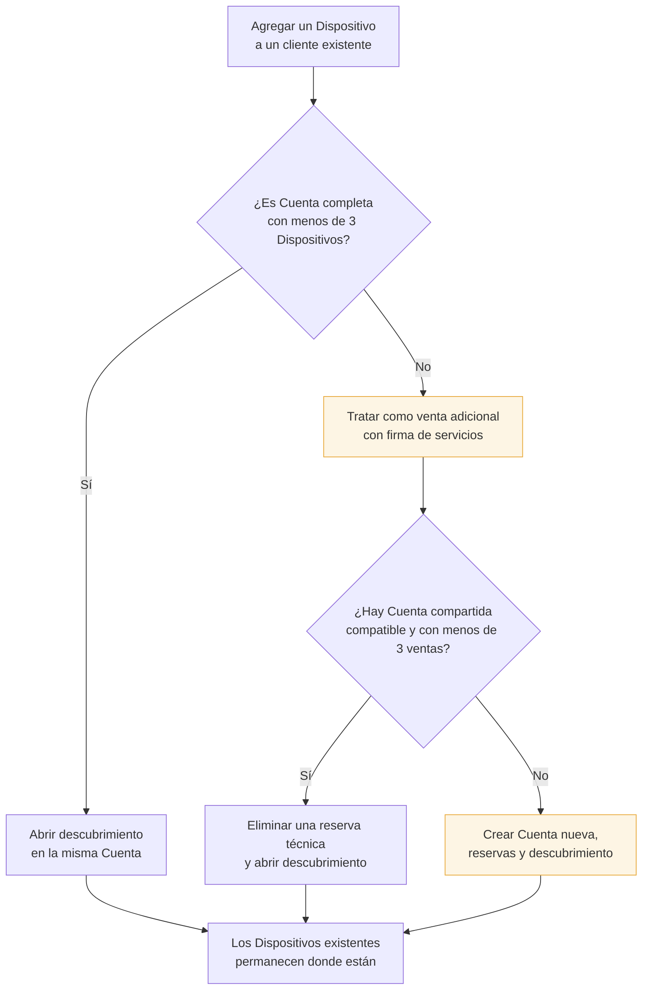

# Flujo — Dispositivo adicional sin migración imposible

Cuando un Cliente Final que ya tiene Dispositivos pide uno más, el sistema respeta el máximo global
de 3 por Cuenta. Si la Cuenta actual está completa, los Dispositivos existentes **no se migran**:
la venta adicional usa otra Cuenta compatible o crea una nueva.

## Regla central

> Nunca se intentan alojar cuatro Dispositivos en una Cuenta ni se trasladan los tres existentes
> para hacerlo posible.

La venta adicional puede quedar en otra Cuenta y, por lo tanto, usar las credenciales de esa nueva
Cuenta. El panel debe mostrarlo antes de confirmar.

## Venta unitaria

Una venta unitaria autoriza exactamente 1 Dispositivo. Agregar otro servicio al mismo Cliente Final
es una venta nueva: el wizard calcula su firma de servicios, busca una Cuenta compartida compatible
y libera exactamente una reserva técnica antes del descubrimiento.

## Ver también

- [[Capacidad de una Cuenta]]
- [[Flujo - Alta de Cliente Final]]
