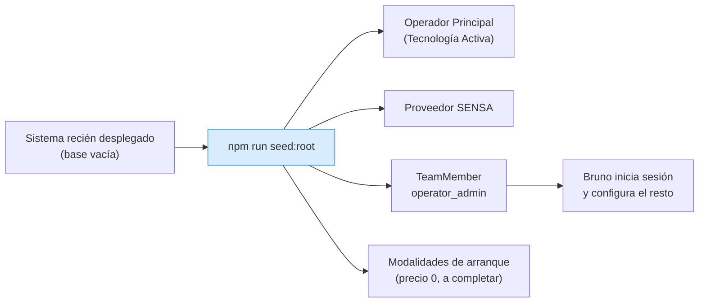
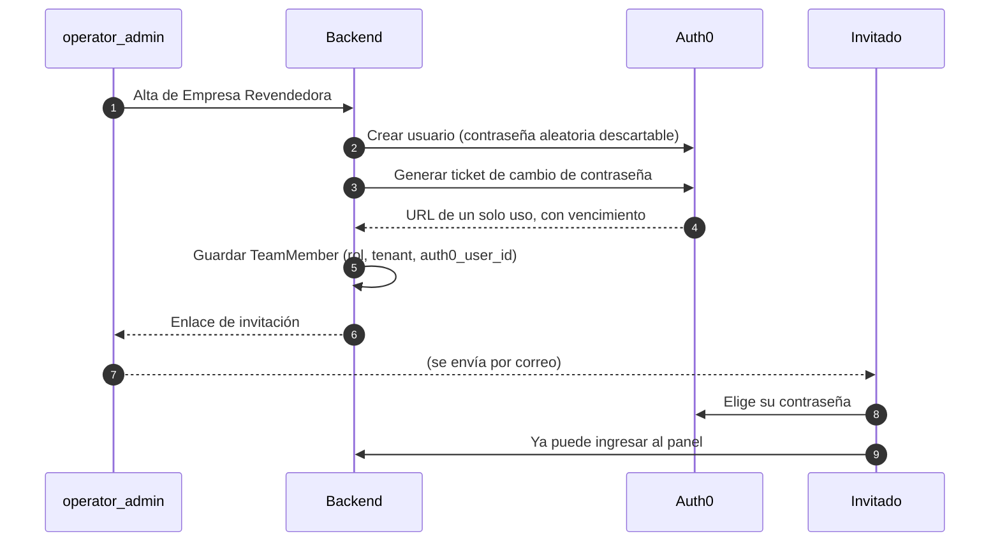

# Arranque en frío y seed

## El problema del huevo y la gallina

El sistema exige un `operator_admin` para dar de alta cualquier cosa. Pero ese primer
`operator_admin` **no puede crearse desde el panel**, porque en ese momento no existe nadie con
permisos para crearlo.



## El seed

```bash
docker compose exec backend npm run seed:root
```

Es **idempotente**: correrlo dos veces no duplica nada. Eso importa porque queda pendiente definir con
Federico si conviene engancharlo al arranque del contenedor
(ver [[Decisiones pendientes]]); si mañana se decide eso, el script ya lo soporta.

Sobre el usuario de Auth0, el seed maneja tres escenarios:

| Escenario | Qué hace |
|---|---|
| `SEED_ROOT_AUTH0_USER_ID` informado | Usa ese usuario ya creado a mano en Auth0 |
| Credenciales de Management API disponibles | Crea el usuario y muestra el link de invitación |
| Ninguna de las dos | Registra el Team Member sin `auth0_user_id` y explica cómo completarlo |

Se eligió no fallar en el tercer caso: el resto de la configuración inicial queda hecha igual.

## Invitación del resto del equipo

Todos los demás Team Members —en el MVP, el `reseller_admin` de cada Empresa Revendedora— se dan de
alta desde el panel, con **Password Change Tickets** de Auth0:



**Nadie conoce nunca la contraseña del invitado:** ni IPTVControl, ni el Operador Principal. La
contraseña aleatoria con la que se crea el usuario en Auth0 se descarta sin usarse.

Si el enlace vence o el correo se pierde, el panel tiene "Reenviar invitación": genera un ticket
nuevo para el mismo usuario, sin recrearlo.

## Salvaguarda del último administrador

El sistema **no permite dar de baja al último `operator_admin` activo**. Es el problema del arranque
en frío al revés: sin él, nadie podría volver a administrar el sistema.

## Ver también

- [[Team Members]]
- [[Despliegue y operación]]
- [[Decisiones pendientes]]
