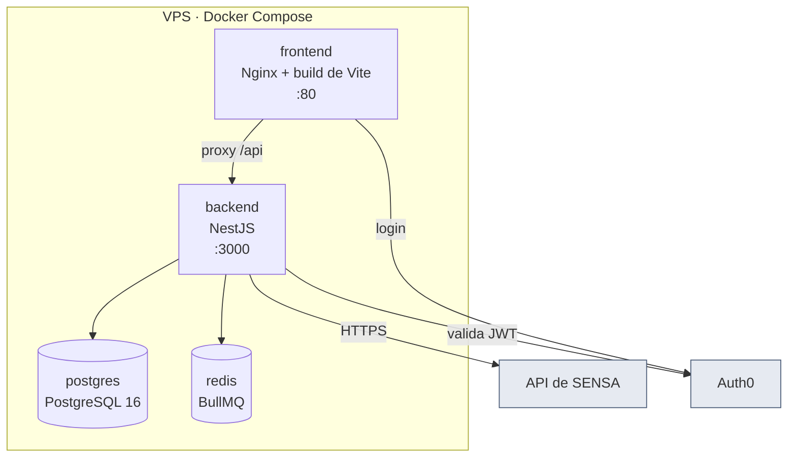

# Despliegue y operación

VPS propio con Docker Compose. **Producción controlada desde el arranque**, sin staging separado.

## Servicios



## Primer despliegue

```bash
# 1. Variables de entorno
cp .env.example .env
#    y completar, como mínimo:
#      POSTGRES_PASSWORD, APP_DB_PASSWORD
#      ENCRYPTION_MASTER_KEY   (openssl rand -hex 32)
#      AUTH0_DOMAIN, AUTH0_AUDIENCE, AUTH0_MGMT_CLIENT_ID/SECRET
#      SEED_ROOT_EMAIL

# 2. Levantar todo (el backend aplica las migraciones al arrancar)
docker compose up -d --build

# 3. Provisionar el primer acceso, UNA sola vez
docker compose exec backend npm run seed:root
```

## Dos usuarios de base de datos, a propósito

| Usuario | Para qué | Sujeto a RLS |
|---|---|---|
| `iptvcontrol` (owner) | Migraciones de Prisma y el seed | **No** (el owner ignora RLS) |
| `iptvcontrol_app` | Runtime de la aplicación | **Sí** |

Si la aplicación se conectara con el owner, el [[Aislamiento multi-tenant]] por RLS no aplicaría
nunca. El script `docker/postgres/init/01-app-user.sh` crea el usuario de aplicación sin `BYPASSRLS`.

## Qué configurar en el panel después del seed

1. **Configuración → Conexión con el proveedor**: servidor, puerto, usuario y token. Probar la
   conexión antes de guardar.
2. **Planes comerciales**: cargar los precios reales (el seed los deja en 0).
3. **Empresas Revendedoras**: dar de alta la primera. El sistema envía la invitación de acceso.

## Verificaciones

```bash
# Estado del backend y de la base
curl http://localhost:3000/api/v1/health

# Documentación de la API (requiere login)
#   http://localhost:3000/api/docs

# Aislamiento multi-tenant, como el usuario de aplicación
docker compose exec -T -e PGPASSWORD=<app_pass> postgres \
  psql -U iptvcontrol_app -d iptvcontrol -h 127.0.0.1 \
  < backend/prisma/verificar-rls.sql
```

## Problemas que ya nos pasaron

| Síntoma | Causa y solución |
|---|---|
| El panel no responde en `:8080` pero el contenedor está *healthy* y Nginx responde bien adentro (`docker exec iptvcontrol-frontend wget -qO- http://127.0.0.1/`) | El reenvío de puerto de Docker quedó colgado, normalmente después de recrear otro servicio de la misma red. Se arregla con `docker compose up -d --force-recreate frontend`. No es un problema de la aplicación. |
| `FATAL: could not open file "global/pg_filenode.map": I/O error` o `write /var/lib/docker/...: input/output error` | Falla del disco de la VM de Docker Desktop, no de IPTVControl. Hay que reparar o reiniciar Docker Desktop; los datos sobreviven porque están en un volumen con nombre. |
| El backend arranca pero avisa `AUTH0_DOMAIN no está configurado` | Falta completar Auth0 en el `.env`. Con `NODE_ENV=development` el backend arranca igual para poder trabajar, pero **no se puede iniciar sesión** hasta configurarlo. |
| El seed dice "El Team Member ya existe" | Es lo esperado: el seed es idempotente. No duplica nada al correrlo dos veces. |

## Backups

A cargo del **departamento de infraestructura** de Tecnología Activa, por fuera del desarrollo. Lo
que sí importa saber: además de la base, hay que resguardar la variable
`ENCRYPTION_MASTER_KEY` — sin ella, las credenciales cifradas de las Cuentas son irrecuperables.

## Ver también

- [[Arranque en frío y seed]]
- [[Stack técnico]]
