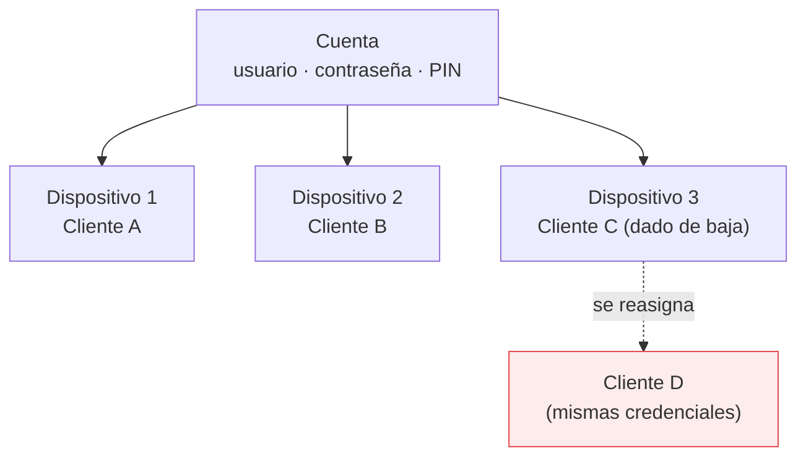

# Riesgo aceptado — contraseña compartida sin rotación

> [!important] Esto **no** es una decisión pendiente
> Es un riesgo de negocio **ya evaluado y aceptado**, confirmado por Bruno. No debe tratarse como
> algo a resolver ni listarse entre los pendientes.

## El riesgo

Hasta 6 Clientes Finales pueden compartir la misma Cuenta, y por lo tanto **las mismas credenciales**,
sin saberlo entre sí. Y cuando un Cliente Final se da de baja definitiva, su Dispositivo queda
disponible: el Cliente Final nuevo que lo tome **recibe esas mismas credenciales**.

Consecuencia concreta: el cliente saliente podría seguir usando el servicio con la clave vieja.

## Por qué se acepta

Rotar la contraseña en cada reasignación obligaría a **notificar la clave nueva a todos los demás
Clientes Finales activos de esa Cuenta**. Esa complejidad operativa y de soporte es el costo que se
decidió no afrontar, como parte del trade-off para lograr mayor rentabilidad operativa.

## Alcance de la decisión

- **Descartado para siempre**, no para "una segunda etapa": el sistema **no** implementa rotación ni
  notificación automática de contraseña.
- Si alguna vez hace falta cambiar la contraseña de una Cuenta puntual, **lo hace Bruno manualmente**,
  por fuera del sistema.
- En la **suspensión** el riesgo no aplica: el Dispositivo queda bloqueado y no se reasigna mientras
  dure. Ver [[Ciclo de vida del Cliente Final]].

## Qué hace el sistema al respecto

No lo esconde. El panel avisa explícitamente:

- Al reasignar un Dispositivo liberado: *"El cliente nuevo va a recibir las mismas credenciales de
  esta cuenta que tenía el cliente anterior. El sistema no cambia la contraseña."*
- Al dar de baja: *"El dispositivo queda disponible para otro cliente, que va a recibir las mismas
  credenciales de esta cuenta."*
- En la vista de una Cuenta compartida: *"todos los clientes finales que tengan un dispositivo acá
  usan estas mismas credenciales"*.

## Ver también

- [[Decisiones pendientes]] — para lo que sí está abierto
- [[Capacidad de una Cuenta]]
